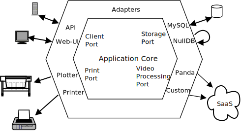

!SLIDE subsection center
# Standard Rails Application

!SLIDE subsection
# MVC -- the Good

* simple to understand
* easy to get started
* rapid prototyping

!SLIDE subsection
# MVC -- the Bad

> The limits of my language are the limits of my mind. All I know is what I
> have words for.

> Ludwig Wittgenstein

!SLIDE subsection
# MVC -- and the Ugly

* high coupling
* obese models
* brittle, slow tests
* change becomes ever more harder as the application grows

!SLIDE center smaller

<http://www.flickr.com/photos/duncan/99863704/>

!SLIDE subsection center
# The Hexagon

!SLIDE subsection
# Ports

* a *Port* defines an API for the core to communicate with an external entity
  like a data store
  * *primary ports* drive the application
  * *secondary ports* are driven by the application

!SLIDE subsection
# Adapters
* an *Adapter* implements the API for a specific technology like a MySQL or
  in-memory database
* depends on domain objects
* transparent for domain objects

!SLIDE subsection
# Properties of P&A

* no fixed number of ports and adapters
* dependencies point inwards
* core code *must not* know about adapters

!SLIDE subsection
# Properties of P&A (cont.)

* less coupling of application core to specific technologies
* simple replacement of technologies possible
* facilitates change
* faster tests for application core logic (real unit tests)

!SLIDE subsection
# Questions?

!SLIDE subsection
# Resources

* <http://alistair.cockburn.us/Hexagonal+architecture>
* <http://www.confreaks.com/videos/977-goruco2012-hexagonal-rails>
* <http://rubyrogues.com/078-rr-hexagonal-rails-with-matt-wynne-and-kevin-rutherford/>
